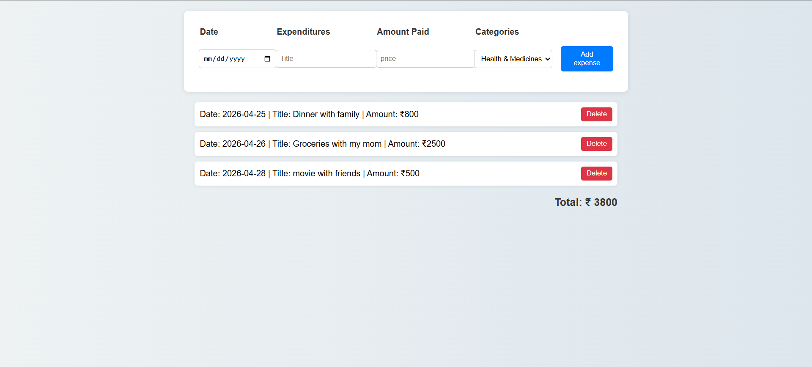
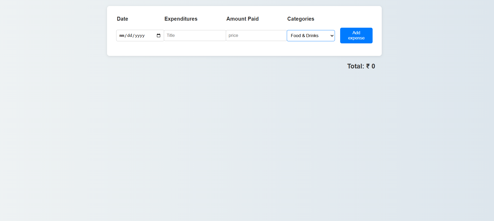

# 💰 Expense Tracker

A simple and efficient Expense Tracker web application built using **HTML, CSS, and JavaScript**.
This app helps users track daily expenses, manage spending, and view total expenses in real-time.

---

## 🚀 Features

* Add expenses with date, title, amount, and category
* Delete expenses easily
* Real-time total expense calculation
* Data stored in **localStorage** (persists after refresh)
* Clean and responsive UI

---

## 🛠️ Tech Stack

* HTML
* CSS
* JavaScript (Vanilla JS)

---

## 📸 Demo

  
  

---

## 📂 Project Structure

* `index.html` – Structure of the app
* `style.css` – Styling and layout
* `script.js` – Logic and functionality

---

## 🧠 What I Learned

* DOM manipulation
* Event handling
* Working with arrays and objects
* LocalStorage usage
* Dynamic UI rendering

---

## ▶️ How to Run

1. Clone the repository
2. Open `index.html` in your browser

---

## 📌 Future Improvements

* Edit expense feature
* Filter by category
* Monthly summary

---

## 🙌 Author

Tarique Alam
